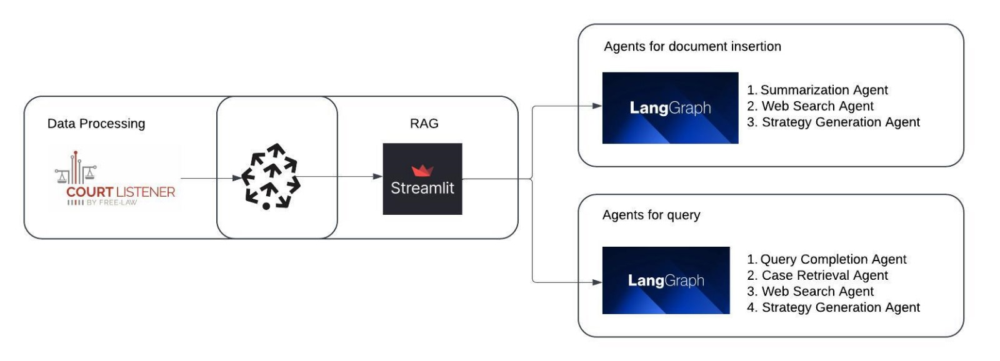

# Lawyer Assistant Intelligent Platform

---

## Attestation and Contribution Declaration

WE ATTEST THAT WE HAVEN'T USED ANY OTHER STUDENTS' WORK IN OUR ASSIGNMENT AND ABIDE BY THE POLICIES LISTED IN THE STUDENT HANDBOOK.

**Contribution Breakdown**:
- Chiu Meng Che: 34%  
- Shraddha Bhandarkar: 33%  
- Kefan Zhang: 33%  

---

## Workflow Diagram

---

## Project Description

This project aims to provide two intelligent services tailored for lawyers:

1. **Solution 1**: Lawyers can upload case files (PDF). The system will generate a case summary, retrieve similar cases from the Pinecone database, and generate strategic advice using GPT models. This solution simplifies document review, acting as a "junior assistant" for lawyers.
2. **Solution 2**: Lawyers can input case ideas using four core elements: Facts, Issues, Reasoning, and Decision. The system generates embeddings for these elements, searches for similar metadata in the Pinecone database (including related documents and the four elements), and generates advice using GPT models. This solution provides lawyers with comparable historical cases, especially for rare or unique case scenarios.

---

## Key Functionalities

### Solution 1

1. **Case Summarization (Summarization Agent)**
   - **Function**: Generates concise summaries for uploaded case files (PDF).
   - **Implementation**:
     - Uses OpenAI GPT-3.5 Turbo API to generate summaries from text content.
     - Generates vector embeddings for the content and stores them in the Pinecone database.

2. **Similar Case Retrieval and Advice Generation (Strategy Generation Agent)**
   - **Function**:
     - Retrieves the most relevant cases from the Pinecone database.
     - Uses OpenAI GPT-4 to generate strategic advice based on retrieved metadata (Facts, Issues, Reasoning, Decision).
   - **Implementation**:
     - Uses HuggingFace model `all-MiniLM-L6-v2` to create vector embeddings (free model).
     - Performs cosine similarity search within Pinecone.

3. **One-Click Web Search (Web Search Agent)**
   - **Function**: Provides online search for user queries.
   - **Implementation**:
     - Transforms user queries into natural language search.
     - Summarizes search results using GPT models and presents concise answers.

---

### Solution 2

1. **Query Completion (Query Completion Agent)**
   - **Function**: Completes incomplete descriptions provided by lawyers (Facts, Issues, Reasoning, Decision).
   - **Implementation**:
     - Uses OpenAI GPT-4 to complete user inputs.
     - Extracts core elements and generates semantic embeddings.

2. **Case Retrieval (Case Retrieval Agent)**
   - **Function**: Searches Pinecone for cases similar to the lawyer's input.
   - **Implementation**:
     - Uses `all-MiniLM-L6-v2` to generate input embeddings.
     - Searches using Pinecone's vector similarity search.

3. **Metadata Analysis and Recommendations**
   - **Function**: Analyzes similar case metadata and documents, generating strategic advice.
   - **Implementation**:
     - Uses GPT-4 to create a structured report, including legal insights and recommended actions.

4. **Strategy Advice Generation (Strategy Generation Agent)**
   - **Function**: Combines user inputs and retrieved data to generate personalized recommendations.
   - **Implementation**:
     - GPT-4 analyzes user input and retrieved case data to provide actionable solutions.

---

## Technology Stack

1. **Data Processing and Storage**
   - **Pinecone**: Stores case file embeddings and metadata for fast similarity search.
   - **Snowflake**: Stores case metadata and search history for further analysis.

2. **Natural Language Processing**
   - **HuggingFace Models**:
     - `all-MiniLM-L6-v2`: Generates vector embeddings for similarity search (free and lightweight).
   - **OpenAI GPT-4**:
     - Used for summarization, query completion, strategic advice generation, and case analysis.

3. **Frontend and Backend**
   - **Backend**:
     - **FastAPI**: Manages API requests and integrates NLP models and database operations.
   - **Frontend**:
     - **Streamlit**: Provides a user-friendly interface for file upload and result display.

4. **Task Scheduling and Search**
   - **Apache Airflow**: Handles task scheduling, including file processing, vector generation, and data retrieval.
   - **SERP API**: Enables online search for supplemental information.

---

## Workflow

### Solution 1 Workflow
1. The user uploads a case file (PDF).
2. The system extracts file content and performs the following:
   - **Summarization**: Generates a concise summary using NLP models.
   - **Embedding Generation**: Creates vector embeddings using `all-MiniLM-L6-v2`.
   - **Storage**: Stores embeddings in Pinecone and metadata in Snowflake.
3. The system retrieves similar cases and uses GPT to generate strategic advice.
4. Users can perform additional web searches for unresolved questions.

### Solution 2 Workflow
1. The user inputs four core elements: Facts, Issues, Reasoning, Decision.
2. **Query Completion**:
   - Completes incomplete inputs using GPT.
   - Generates embeddings for the completed input.
3. **Case Retrieval**:
   - Searches Pinecone for the most relevant cases.
   - Retrieves metadata and related documents.
4. **Advice Generation**:
   - GPT generates a report based on retrieved metadata.
5. The system presents the advice and related case details to the user.

---

## Project Value

1. **Efficiency**: Automates summarization and strategy generation, reducing repetitive work for lawyers.
2. **Intelligent Support**: Provides precise case analysis and advice through vector search and GPT.
3. **Flexibility**: Supports both document-based workflows (Solution 1) and idea-based workflows (Solution 2).
4. **Cost-Effectiveness**: Utilizes free vector models (e.g., `all-MiniLM-L6-v2`) and efficient databases (Pinecone) to minimize costs.

This project aims to be an indispensable tool for lawyers, enhancing their productivity and providing valuable insights for legal analysis.
